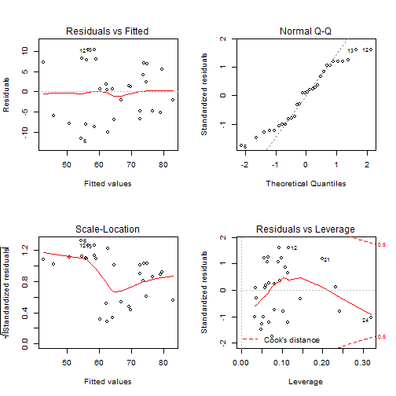

## Introduction

The aim of this presentation is to present the application that I created for the user to get to experience single and multiple variable regression on a dataset "attitude", which relates employee characteristics such as his/her ability to handle complaints to overall rating.

The description of the variables are: I. rating - Overall rating; II. complaints - Handling of employee complaints; III. privileges - Does not allow special privileges; IV. learning - Opportunity to learn; V. raises - Raises based on performance; VI. critical - Too critical; VII. advance - Advancement.

A report accompanies this presentation, available [here](http://http://lmsv-mx123.github.io/devdataprod/Report/DocDevDataProdProj.html)

The application is hosted [here](https://lmsv-mx123.shinyapps.io/devdataprodapp)

More source on the data: Chatterjee, S. and Price, B. (1977) Regression Analysis by Example. New York: Wiley. (Section 3.7, p.68ff of 2nd ed.(1991).)

---

## Application description

The Application presents the user with 3 options on which the dataset "attitude" can be analysed

- BoxPlot: Presents data for rating vs the chosen dependent variable/characteristic.
- Single-Regression model: Gives a scatter plot of the rating vs the chosen variable, fitted with the linear model calculated from the chosen variable. Additionally, a summary with the residuals, coefficients and R-squared information is presented.
- Mutiple-Regression model: Gives a 2x2 matrix plot (Residuals vs Fitted & Scale location to see if there is a particular pattern, Normal Q-Q plot to see if the distibution is normal, and Residuals vs Leverage to see is there is a particular outlier to be concerned) computed from the selected variables/characteristics. Like the single-regression, multiple-regression shows also the summary of the linear model computed.

---

## The data set

- The data comes from Chatterjee–Price Attitude Data.
- It is a data frame of 30 observations (departments) with the following summary


```
##      rating        complaints     privileges       learning    
##  Min.   :40.00   Min.   :37.0   Min.   :30.00   Min.   :34.00  
##  1st Qu.:58.75   1st Qu.:58.5   1st Qu.:45.00   1st Qu.:47.00  
##  Median :65.50   Median :65.0   Median :51.50   Median :56.50  
##  Mean   :64.63   Mean   :66.6   Mean   :53.13   Mean   :56.37  
##  3rd Qu.:71.75   3rd Qu.:77.0   3rd Qu.:62.50   3rd Qu.:66.75  
##  Max.   :85.00   Max.   :90.0   Max.   :83.00   Max.   :75.00  
##      raises         critical        advance     
##  Min.   :43.00   Min.   :49.00   Min.   :25.00  
##  1st Qu.:58.25   1st Qu.:69.25   1st Qu.:35.00  
##  Median :63.50   Median :77.50   Median :41.00  
##  Mean   :64.63   Mean   :74.77   Mean   :42.93  
##  3rd Qu.:71.00   3rd Qu.:80.00   3rd Qu.:47.75  
##  Max.   :88.00   Max.   :92.00   Max.   :72.00
```

---

## The best linear model

- From the six attitude characteristics, the best model computed takes into account complaints and learning. Accounts for 68.63867% of the variance.

 
