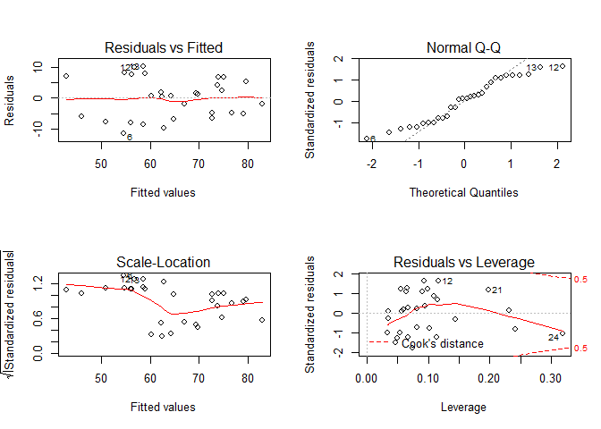
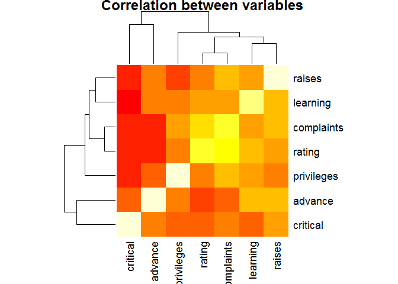
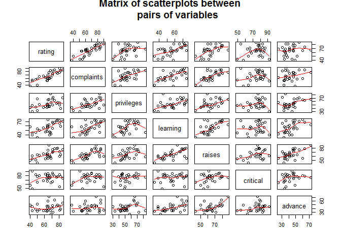
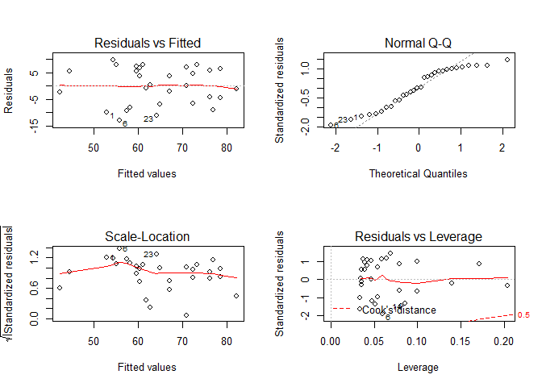
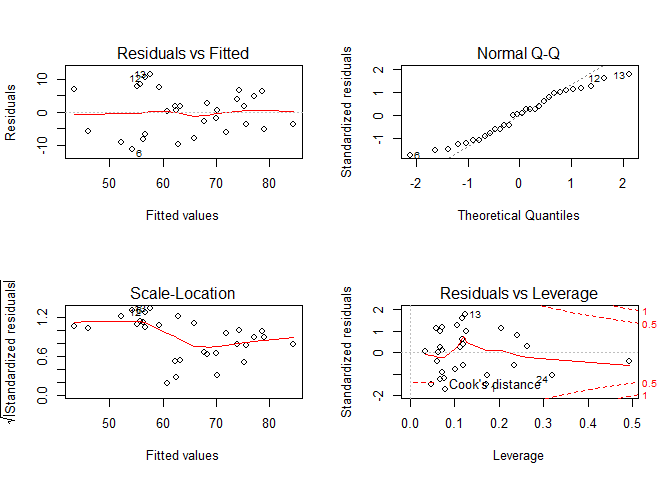

# Impacts of characteristics on overall rating

## Executive Summary
Rating for employees depend on factors such as if they are able to handle complaints, allow or not privileges, and provide learning opportunities, just to name a few. The attitude data set is a collection of data for which overall rating is influenced by the following factors: complaints, privileges, learning, raises, critical and advance. These variables, however, are correlated. A basic model taking only into account complaints is a good linear model, but not the best. The best computed model adds learning aditionally to complaints, for which each complaint handled gives 0.64 more rating and 0.21 rating is increased for each learning opportunity provided.

## Initialization and exploratory data analysis
Load required libraries and echo code used.

```r
library(datasets)
library(ggplot2)
setwd("~/")
```
Let's examine the dataset.

```r
str(attitude,vec.len=1)
```

```
## 'data.frame':	30 obs. of  7 variables:
##  $ rating    : num  43 63 ...
##  $ complaints: num  51 64 ...
##  $ privileges: num  30 51 ...
##  $ learning  : num  39 54 ...
##  $ raises    : num  61 63 ...
##  $ critical  : num  92 73 ...
##  $ advance   : num  45 47 ...
```
It is a data frame of 30 observations (departments) with the following variables:
1. rating - Overall rating
2. complaints - Handling of employee complaints
3. privileges - Does not allow special privileges
4. learning - Opportunity to learn
5. raises - Raises based on performance
6. critical - Too critical
7. advance - Advancement

All variables are numeric

## Analysis
Overall rating for clerical employees is influenced by factors such as the handling of complaints, if they allow special privileges or provide learning oportunities, etc. (The appendix provides some plots in the correlations between variables). For instance, if we look at a one-variable regression between rating and complaints, we get


```r
fit_basic <- lm(rating~complaints, data=attitude)
print(t(summary(fit_basic)$coefficients))
```

```
##            (Intercept)   complaints
## Estimate   14.37631941 7.546098e-01
## Std. Error  6.61998601 9.753289e-02
## t value     2.17165405 7.736978e+00
## Pr(>|t|)    0.03850833 1.987682e-08
```

```r
print(summary(fit_basic)$adj.r.squared)
```

```
## [1] 0.6699325
```
Without complaints, the base rating is 14 which for each complaint that the employee is able to handle the expected rating goes up by 0.75. Taking into consideration only complaints accounts for 67% of the variance and there is most likely a better model if multivariable is used. Taking into consideration three out of the six variables, for example complaints, privileges, and learning provides the following result:
 

```r
fit_another <- lm(rating~complaints+privileges+learning,
                  data=attitude)
print(summary(fit_another)$coefficients[,1:3])
```

```
##               Estimate Std. Error    t value
## (Intercept) 11.2583051  7.3183404  1.5383686
## complaints   0.6824165  0.1288445  5.2964340
## privileges  -0.1032843  0.1293454 -0.7985149
## learning     0.2379762  0.1394103  1.7070208
```

```r
print(summary(fit_another)$adj.r.squared)
```

```
## [1] 0.6821203
```
This new model acounts for a little bit more of the variance than the single variable model. The base rating goes down to 11 with each complaint handled increasing it by 0.68, each privilege not allowed decreasing it by 0.10 and each learning opportunity increases rating by 0.24.

Taking into account every variable perhaps leads to a better result. Inputing this into R, leads to

```r
fit_all <- lm(rating~complaints+privileges+learning+raises+critical+advance,
                  data=attitude)
print(summary(fit_all)$coefficients[,1:3])
```

```
##                Estimate Std. Error    t value
## (Intercept) 10.78707639 11.5892572  0.9307824
## complaints   0.61318761  0.1609831  3.8090182
## privileges  -0.07305014  0.1357247 -0.5382229
## learning     0.32033212  0.1685203  1.9008516
## raises       0.08173213  0.2214777  0.3690310
## critical     0.03838145  0.1469954  0.2611064
## advance     -0.21705668  0.1782095 -1.2179862
```

```r
print(summary(fit_all)$adj.r.squared)
```

```
## [1] 0.662846
```
Although factors such as base rating remain close to the previous results, the accounted R^2 actually went down by 2%! Perhaps the best model is a combination of the variables, and for that let's use the step function to determine what the best linear model is

```r
fit_best <- step(lm(rating~., data=attitude),
                 direction="both", trace=0)
```

```r
print(summary(fit_best)$call)
##Call:
##lm(formula=rating~complaints+learning,data=attitude)
```

```r
print(summary(summary(fit_best)$residuals))
```

```
##     Min.  1st Qu.   Median     Mean  3rd Qu.     Max. 
## -11.5600  -5.7330   0.6701   0.0000   6.5340  10.3600
```

```r
print(summary(fit_best)$coefficients[,1:3])
```

```
##              Estimate Std. Error  t value
## (Intercept) 9.8708805  7.0612236 1.397899
## complaints  0.6435176  0.1184774 5.431563
## learning    0.2111918  0.1344037 1.571324
```

```r
print(summary(fit_best)$adj.r.squared)
```

```
## [1] 0.6863867
```
Surprisingly enough, the best model is only based on complaints and learning. With this model, the base rating is 9.87, which increases by 0.64 for each complaint handled and 0.21 for each learning opportunity provided.

```r
par(mfrow=c(2, 2))
plot(fit_best)
```

 
The plots of Residuals vs Fitted and Scale-Location show no particular pattern. Additionally, the Normal Q-Q plot depicts that the residuals follow approximately a Normal distribution and from the plot of Residuals vs Leverage, there is no outlier to be concerned.

## Conclusions
Although the overall rating for clerical employees depends on factors such as complaints, learning, privileges, raises, critical, advance, it is only the first two factors which make up the best model from the attitude data set.

## Appendix

### Attitude data set correlations

```r
data(attitude)
heatmap(cor(attitude), main=
          "Correlation between variables")
```

 


```r
pairs(attitude, panel=panel.smooth, main=
        "Matrix of scatterplots between
      pairs of variables")
```

 

### Residual plots for basic and another fit models

```r
par(mfrow=c(2, 2))
plot(fit_basic)
```

 


```r
par(mfrow=c(2, 2))
plot(fit_another)
```

 
